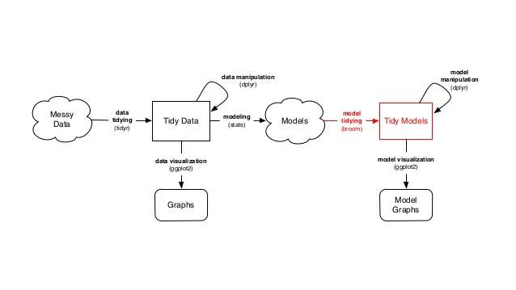

```{r Setup, include=FALSE, results='hide', warning=FALSE}
hook_output = knitr::knit_hooks$get('output')
knitr::knit_hooks$set(output = function(x, options) {
  # this hook is used only when the linewidth option is not NULL
  if (!is.null(n <- options$linewidth)) {
    x = knitr:::split_lines(x)
    # any lines wider than n should be wrapped
    if (any(nchar(x) > n)) x = strwrap(x, width = n)
    x = paste(x, collapse = '\n')
  }
  hook_output(x, options)
})
knitr::opts_chunk$set(
              dev= "pdf",
               fig.width=4.25,
               fig.height=2.5,
               fig.show="hold",
               fig.lp="fig:",
               fig.align = "center",
               dpi = 300,
               cache=TRUE,
               par=TRUE,
               echo=TRUE,
               message=FALSE,
               warning=FALSE)
```

## 

- `dplyr`
- `tidyr`
- `purrr`
- `tidytext`
- `stringr`

## Intro 

> "Herein lies the dirty secret about most data scientists' work – it's more data munging than deep learning. The best minds of my generation are deleting commas from log files, and that makes me sad. A Ph.D. is a terrible thing to waste."

[Source](http://adage.com/article/digitalnext/dear-madison-avenue-set-data-scientists-free/298676/)

## Data janitor


[Source](http://www.nytimes.com/2014/08/18/technology/for-big-data-scientists-hurdle-to-insights-is-janitor-work.html)

## Raw versus processed data

### Raw data 

The original source of the data

Often hard to use directly for data analysis

You should *never* process your original data

### Processed data

Data that is ready for analysis

Data manipulation involves going from *raw* to *processed* data. 

This can include merging, subsetting, transforming, etc. 

*All* steps that take you from raw to processed data should be scripted

## Today 

Introduce some tricks for working (efficiently) with data 

Introduce concept and tools for working with tidy data (`tidyr`)

Manipulate tidy data using `dplyr`

Iterate over elements using functions (`purrr`)

String processing (`stringr`, regular expressions)

## Workflow



---

\LARGE The Pipe

## Digression: The pipe


## The pipe operator

The pipe operator `%>%` (RStudio has keyboard shortcuts, learn to use them!) let's you write sequences instead of nested functions

`x %>% f(y)` -> `f(x,y)`
    
`x %>% f(z, .)` -> `f(z, x)`

Read `%>%` as "then". First do this, *then* do this, etc...

It's implemented in `R` by a [Danish econometrician](https://twitter.com/stefanbache)

All the packages you will learn today work with the pipe. 

## Intuition 

\centering


[source](http://www.slideshare.net/romainfrancois)

---

\LARGE Tidy data

## `tidyr`  

### Tidy data: observations are in the rows, variables are in the columns

`tidyr`: take your messy data and turn it into a tidy format

Advantages of tidy data:

- Consistency 
- Allows you to spend more time on your analysis 
- Speed

## Tidy data


## Functions in `tidyr`

- `gather`: Reshape from wide to long
- `spread`: Reshape from long to wide 
- `separate`: Split a variable into multiple variables.

(Also more complicated functions such as `nest` for nested data frames, but we won't go into detail with those here)

## Read data

```{r, message = FALSE, tidy=FALSE}
library("readr")
gh.link = "https://raw.githubusercontent.com/"
user.repo = "hadley/tidyr/"
branch = "master/"
link = "vignettes/pew.csv"
data.link = paste0(gh.link, user.repo, branch, link)
df = read_csv(data.link)
```

## Pew data 

### First five columns

```{r, echo = FALSE}
knitr::kable(df[1:3, 1:5])
```

**Question 1**: What variables are in this dataset?

**Question 2**: How does a tidy version of this data look like?

## The `gather` function

**Problem**: Column names are not names of a variable, but *values* of a variable.

**Objective**: Reshaping wide format to long format

To tidy such data, we need to **gather** the non-variable columns into a two-column key-value pair

## `gather`

Three parameters

1. Set of columns that represent values, not variables.
2. Name of the variable whose values form the column names (`key`).
3. The name of the variable whose values are spread over the cells (`value`. 

```{r}
library("tidyr")
args(gather)
```

## `gather` Pew Data

```{r}
df.gather = df %>% 
  gather(key = income, 
         value = frequency, 
         -religion)
```

## 

```{r, echo = FALSE}
knitr::kable(df.gather[1:5, ])
```

## Alternatives

This

```{r, eval = FALSE}
df %>% 
  gather(key = income, 
         value = frequency, 
         2:11)
```

returns the same as 

```{r, eval = FALSE}
df %>% 
  gather(key = income, 
         value = frequency, 
         -religion)
```

## More complicated example

### Billboard data

```{r}
library("readr")
gh.link = "https://raw.githubusercontent.com/"
user.repo = "hadley/tidyr/"
branch = "master/"
link = "vignettes/billboard.csv"
data.link = paste0(gh.link, user.repo, branch, link)
df = read_csv(data.link)
```

## Billboard is a mess

`df[1:5, 1:5]`

```{r, echo = FALSE}
knitr::kable(df[1:5, 1:5])
```

## 

`df[1:5, 6:10]`

```{r, echo = FALSE}
knitr::kable(df[1:5, 6:10])
```

**Question**: what are the variables here? 

## Tidying the Billboard data

To tidy this dataset, we first gather together all the `wk` columns. The column names give the week and the values are the ranks:

```{r}
billboard2 = df %>% 
  gather(key = week, 
         value = rank, wk1:wk76, 
         na.rm = TRUE)
```

## 

Not displaying the `track` column

```{r, echo = FALSE}
knitr::kable(billboard2[1:5, -3])
```

Are we done? 

## Data cleaning

Let's turn the week into a numeric variable and create a proper date column

```{r}
library("dplyr")
billboard3 = billboard2 %>%
  mutate(
    week = extract_numeric(week),
    date = as.Date(date.entered) + 7 * (week - 1)) %>%
  select(-date.entered) %>% 
  arrange(artist, track, week)
```

What functions from `tidyr` did we use here? 

## 

```{r, echo = FALSE}
knitr::kable(billboard3[1:5, 1:5])
```

## WHO example

After gathering columns, the key column is sometimes a combination of multiple underlying variable names. 

```{r, message = FALSE}
library("readr")
gh.link = "https://raw.githubusercontent.com/"
user.repo = "hadley/tidyr/"
branch = "master/"
link = "vignettes/tb.csv"
data.link = paste0(gh.link, user.repo, branch, link)
df = read_csv(data.link)
```

## 

```{r, echo = FALSE}
knitr::kable(df[1:5, 1:8])
```

**Question**: what are the variables here?

## Answer

The dataset comes from the World Health Organisation, and records the \alert{counts} of confirmed tuberculosis cases by \alert{country}, \alert{year}, and \alert{demographic group}. The demographic groups are broken down by \alert{sex} (m, f) and \alert{age} (0-14, 15-25, 25-34, 35-44, 45-54, 55-64, unknown).

## Gathering the non-variable columns

```{r}
tb2 = df %>% 
  gather(demo, n, -iso2, -year, na.rm = TRUE)
```

## 

```{r, echo = FALSE}
knitr::kable(tb2[1:5, 1:4])
```

Is this dataset tidy?

## Separating the `demo` variable

`separate` makes it easy to split a variable into multiple variables. You can either pass it a regular expression to split on or a vector of character positions. In this case we want to split after the first character.

```{r}
tb3 = tb2 %>% 
  separate(demo, c("sex", "age"), 1)
```

##

```{r, echo = FALSE}
knitr::kable(tb3[1:5, 1:5])
```

## Reshaping from long to wide format

There are times when we are required to turn long formatted data into wide formatted data. The `spread` function spreads a key-value pair across multiple columns.

## `spread` in action

```{r}
tb3.wide = tb3 %>% spread(age, n)
```

## 

```{r, echo = FALSE}
knitr::kable(tb3.wide[1:5, 1:8])
```

---

\LARGE Data Manipulation

## The Split-Apply-Combine approach 

Once you have your data stored in tidy form, you can easily apply a \alert{split-apply-combine strategy}, where you break up a big problem into manageable pieces, opereate on each piece independently and then put the pieces back together


## Split-Apply-Combine


## The `dplyr` package

`dplyr`: (efficiently) split-apply-combine for data frames

**Verbs** 
a verb is a function that takes a data frame as it's first argument

- `filter`: select rows
- `arrange`: order rows
- `select`: select columns
- `rename`: rename columns
- `distinct`: find distinct rows
- `mutate`: add new variables
- `summarise`: summarize across a data set
- `sample_n`: sample from a data set 

## Data

In this part of the lecture we will work with the Danish federal budget proposal for 2016

```{r, message = FALSE, warning = FALSE}
library("readr")
library("dplyr")
gh.link = "https://raw.githubusercontent.com/"
user.repo = "sebastianbarfort/sds_summer/"
branch = "gh-pages/"
link = "data/finanslov_tidy.csv"
data.link = paste0(gh.link, user.repo, branch, link)
df = read_csv(data.link)
```

Some nice guy has already cleaned this data for you

## View the data

### Try yourself

```{r, eval = FALSE}
View(df)
glimpse(df)
summary(df)
head(df)
```

## Filtering data I

`filter` return rows with matching conditions.

```{r}
df.max.udgift = df %>% 
  filter(udgift == max(udgift)) %>% 
  select(paragraf, aar, udgift)
```

```{r, echo = FALSE}
knitr::kable(df.max.udgift)
```

## Filtering data II

```{r}
df.skat = df %>% 
  filter(paragraf == "Skatter og afgifter") %>%
  select(paragraf, aar, udgift) %>% 
  arrange(-udgift)
```
```{r, echo = FALSE}
knitr::kable(df.skat[1:5, ])
```

## Logical operators


## Creating new variables

`mutate` let's you add new variables to your data frame

```{r}
df.mutated = df %>%
  mutate(newVar = udgift/2) %>%
  select(newVar, udgift)
```

```{r, echo = FALSE}
knitr::kable(df.mutated[1:5, ])
```

## Sampling from a data frame

We can sample from a data frame using `sample_n` and `sample_frac`

```{r}
df.sample.n = df %>% 
  select(paragraf, aar, udgift) %>%
  sample_n(3)
```

```{r, echo = FALSE}
knitr::kable(df.sample.n)
```

## Grouped operations

So far, we have primarily learned how to manipulate data frames. 

The `dplyr` package becomes really powerful when we introduce the `group_by` function

`group_by` breaks down a dataset into specified groups of rows. When you then apply the verbs above on the resulting object they’ll be automatically applied "by group".

Use in conjunction with `mutate` (to add existing rows to your data frame) or `summarise` (to create a new data frame)

## Common `mutate`/`summarise` options

- `mean`: mean within groups
- `sum`: sum within groups
- `sd`: standard deviation within groups
- `max`: max within groups
- `n()`: number in each group
- `first`: first in group
- `last`: last in group
- `nth(n = 3)`: nth in group (3rd here)
- `tally`: count number in group

## Operating on groups I

Which ministry has the largest expenses?

```{r}
df.expense = df %>% 
  group_by(paragraf) %>% 
  summarise(sum.exp = sum(udgift, na.rm = TRUE)) %>% 
  arrange(-sum.exp)
```

```{r, echo = FALSE}
knitr::kable(df.expense[1:5, ])
```

## Operating on groups II

Add `sum.exp` to existing data frame

```{r}
df.2 = df %>% 
  group_by(paragraf) %>% 
  mutate(sum.exp = sum(udgift, na.rm = TRUE)) %>% 
  select(paragraf, udgift, sum.exp)
```

```{r, echo = FALSE}
knitr::kable(df.2[1:5, ])
```

## Operating on groups III

You can group by several variables

```{r}
df.expense.2 = df %>% 
  group_by(paragraf, aar) %>% 
  summarise(sum.exp = sum(udgift, na.rm = TRUE)) %>% 
  arrange(sum.exp)
```

```{r, echo = FALSE}
knitr::kable(df.expense.2[1:5, ])
```

## Operating on groups IV

Let's first calculate yearly expenses at the `paragraf` level and then calculate mean expenses over the years.


```{r}
df.expense.3 = df %>% 
  group_by(paragraf, aar) %>% 
  summarise(exp = sum(udgift, na.rm = TRUE)) %>%
  ungroup() %>%
  group_by(paragraf) %>%
  summarise(sum.exp = mean(exp, na.rm = TRUE))
```

##

```{r, echo = FALSE}
knitr::kable(df.expense.3[1:5, ])
```

## Merging data sets

\centering


## Superhero example

```{r, echo = FALSE}
superheroes = c("    name, alignment, gender,         publisher",
    " Magneto,       bad,   male,            Marvel",
    "   Storm,      good, female,            Marvel",
    "Mystique,       bad, female,            Marvel",
    "  Batman,      good,   male,                DC",
    "   Joker,       bad,   male,                DC",
    "Catwoman,       bad, female,                DC",
    " Hellboy,      good,   male, Dark Horse Comics")

superheroes = read.csv(text = superheroes, strip.white = TRUE)
```

### Look at this dataset 

```{r, echo = FALSE}
knitr::kable(superheroes)
```

## Publishers

### And this

```{r, echo = FALSE}
publishers = c("publisher, yr_founded",
    "       DC,       1934",
    "   Marvel,       1939",
    "    Image,       1992")
publishers = read.csv(text = publishers, strip.white = TRUE)
```

```{r, echo = FALSE}
knitr::kable(publishers)
```

## Inner join

```{r}
ijsp = inner_join(superheroes, publishers)
```

```{r, echo = FALSE}
knitr::kable(ijsp)
```

## Left join

```{r}
ljsp = left_join(superheroes, publishers)
```

```{r, echo = FALSE}
knitr::kable(ljsp)
```

## Merging different names

```{r, message = TRUE}
superheroes = superheroes %>% 
  mutate(seblikes = (publisher == "Marvel"))
publishers = publishers %>% 
  mutate(seb = (publisher == "Marvel"))
ij2 = inner_join(superheroes,publishers)
```

## 

```{r, echo = FALSE}
knitr::kable(ij2)
```

## Merging by different names

```{r}
ij2 = inner_join(superheroes, publishers,
                    by=c("publisher"="publisher",
                            "seblikes"="seb"))
```

## 

```{r, echo = FALSE}
knitr::kable(ij2)
```

## Full join

```{r}
fj = superheroes %>%
  full_join(publishers)
```

```{r, echo = FALSE}
knitr::kable(fj[, -c(5, 7)])
```

---

\LARGE Functions and Iteration

## Introduction

Perhaps most important skill for being effective when working with data: write functions.

### Advantages

1. You drastically reduce risk of making mistakes
2. When something exogenous changes, you only need to update code in one place
3. You can give your function an intuitive name that makes your code easier to read

You should write functions to \alert{increase your productivity}.

## 

\centering


## Template

```{r, eval = FALSE}
my_function = function(input1, input2, ..., inputN)
  {
  # define 'output' using input1,...,inputN
  return(output)
  }
```

## Example 

```{r}
add_numbers = function(x, y){
  z = x + y
  return(z)
}

add_numbers(2, 4)
add_numbers(2, 6)
```

## Errors

### Now what

```{r, error = TRUE}
add_numbers(2, "y")
```

## Conditional Execution

```{r}
add_numbers = function(x, y){
  if ( !is.numeric(x) || !is.numeric(y)) {
    warning("either 'x' or 'y' is not numeric")
    return(NA)
  }
  else {
    z = x + y
    return(z)
  }
}
```

## Testing

```{r, warning = TRUE}
add_numbers(2, 4)
add_numbers(2, "y")
```

## Iteration

One important skill for being an effective data analyst was being able to \alert{write functions}. A second is \alert{iteration}. 

Iteration helps you when you need to do the same thing to multiple inputs. For example, repeating the same function on lots of inputs. 

Two iteration paradigms

1. Imperative programming (`for` loops, etc.) 
2. Functional programming 

## Data

Imagine that we have this data frame, called `df`

```{r, echo = FALSE}
df = data.frame(
  a = rnorm(5),
  b = rnorm(5),
  c = runif(5),
  d = rchisq(5, 1)
)
```

```{r, echo = FALSE}
knitr::kable(df)
```

And assume that we want to compute the mean of each column

## The `for` loop

We could iterate through each column, compute the mean and output the results

```{r}
output = vector()
for (i in 1:ncol(df)){
  output[[i]] = mean(df[, i], na.rm = TRUE)
}
output
```

---

\LARGE String Processing


