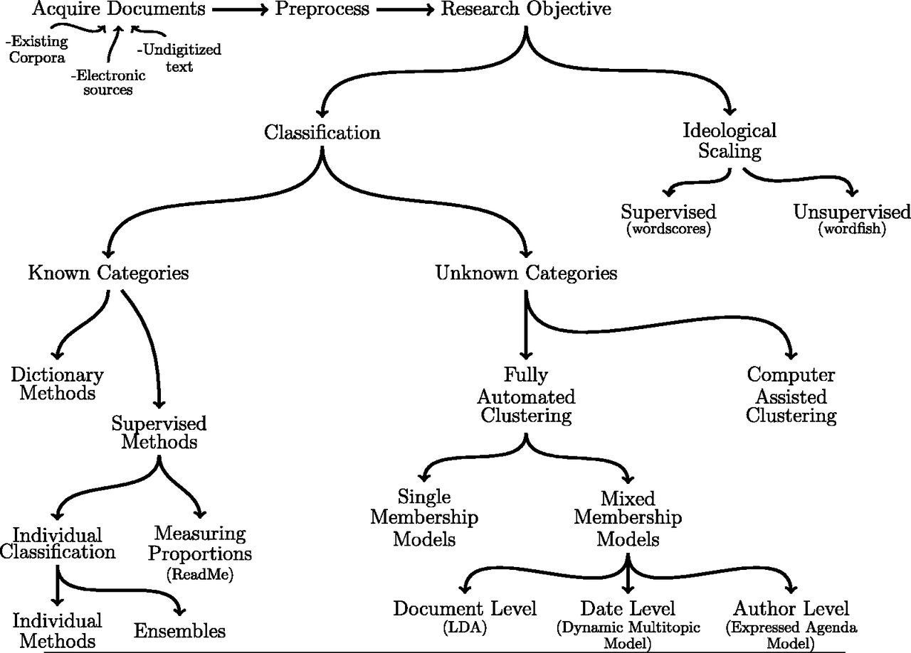

```{r Setup, include=FALSE, results='hide', warning=FALSE}
hook_output = knitr::knit_hooks$get('output')
knitr::knit_hooks$set(output = function(x, options) {
  # this hook is used only when the linewidth option is not NULL
  if (!is.null(n <- options$linewidth)) {
    x = knitr:::split_lines(x)
    # any lines wider than n should be wrapped
    if (any(nchar(x) > n)) x = strwrap(x, width = n)
    x = paste(x, collapse = '\n')
  }
  hook_output(x, options)
})
knitr::opts_chunk$set(
              dev= "pdf",
               fig.width=4.25,
               fig.height=2.5,
               fig.show="hold",
               fig.lp="fig:",
               fig.align = "center",
               dpi = 300,
               cache=TRUE,
               par=TRUE,
               echo=TRUE,
               message=FALSE,
               warning=FALSE)
```

## Text all over the place

> The widespread use of the Internet has led to an astronomical amount of digitized textual data accumulating every second through email, websites, and social media. The analysis of blog sites and social media posts can give new insights into human behaviors and opinions. At the same time, large-scale efforts to digitize previously published articles, books, and government documents have been underway, providing exciting opportunities for social scientists.

*Imai (2016)*.

We need to learn how to think about and work with these kinds of new data

## Resources

\alert{Names} (selective): Will Lowe, Justin Grimmer, Kenneth Benoit, Margaret E. Roberts,
Sven-Oliver Proksch, Suresh Naidy

\alert{R packages}: `tm`, `quanteda`, `stm`, `stringr`, `tidytext`

## Is your favorite professor biased?

Jelveh, Zubin, Bruce Kogut, and Suresh Naidu. "[Detecting Latent Ideology in Expert Text: Evidence From Academic Papers in Economics](http://citeseerx.ist.psu.edu/viewdoc/download?doi=10.1.1.672.7629&rep=rep1&type=pdf)". EMNLP. 2014.


> Previous   work   on   extracting   ideology from text has focused on domains where expression of political views is expected, but it’s unclear if current technology can work  in  domains  where  displays  of  ideology  are  considered inappropriate. We present   a   supervised   ensemble *n*-gram model  for  ideology  extraction  with  topic adjustments and apply it to one such domain: research papers written by academic economists. We show economists’ political  leanings  can  be  correctly  predicted, that our predictions generalize to new domains, and that they correlate with public policy-relevant research findings. We also present evidence that unsupervised models can underperform in domains where ideological expression is discouraged.


## Validation

> We emphasize that the complexity of language implies that automated content analysis methods will never replace careful and close reading of texts. Rather, the methods that we profile here are best thought of as *amplifying* and *augmenting* careful reading and thoughtful analysis. Further, automated content methods are incorrect models of language. This means that the performance of any one method on a new data set cannot be guaranteed, and **therefore validation is essential when applying automated content methods**.

*Grimmer and Stewart (2013)*.

## 

\centering


## Bag of Words 

\alert{Bag of Words}: The ordering and grammar of words does not inform the analysis.

Easy to construct sample sentences where word order fundamentally changes the nature of the sentence, but for most common tasks like measuring sentiment, topic modeling, etc. they do not seem to matter (Grimmer and Stewart 2013)

## Pre-processing

\alert{Stemming}: Dimensionality reduction. Removes the ends of words to reduce the total number of unique words in the data. 

Ex: `family`, `families`, `families'`, etc. all become `famili`.

\alert{Stop words}: Words that do not convey meaning but primarily serve grammatical purposes.

\alert{Uncommon Words}: Typically, words that appear very often or very rarely are excluded. 

Also typically discard punctuation (although not always!), capitalization, etc.

---

\LARGE Classifying Documents into Known Categories

## Introduction

Inferring and assigning text to categories is perhaps most common use of contant analysis in the social sciences

Ex: Classifying ads as positive/negative, is legislation about enviorenment, etc. 

Two broad approaches: 

\alert{Dictionary Methods}: Use relative frequency of *key words* to measure presence of category in a given text

\alert{Supervised Learning}: Build on and extend familiar manual coding tasks using algorithms 

## Dictionary Methods

Perhaps the most simple and intuitive automated text classification method

Use the rate at which key words appear in a text to classify documents into categories or to measure extent to which documents belong to particular category

\alert{Dictionary}: a list of words that classify a particular collection of words

Note: For dictionary methods to work well, the scores attached to each words must closely align with how the words are used in a particular context

Dictionaries are rarely validated

## Supervised Learning Methods

Dictionary methods require that we are able to apriori identify words that separate classes

This can be wrong and/or inefficient

Supervised learning models are designed to automate the hand coding of documents

\alert{Supervised learning models}: Human coders categorize a set of documents by hand. The algorithm then "learns" how to sort the documents into categories using these *training data* and apply its predictions to new unlabeled texts

##  Approach


1. Construct a *training set*
2. Apply the supervised learning method using cross-validation
3. Decide on "best" model and classify the remaining documents

---

\LARGE Classification with Unknown Categories

## Introduction

Supervised and dictionary methods assume a well-defined set of categories

Often, this set of categories is difficult to derive beforehand

Is must be *discovered* from the text itself

\alert{Unsupervised Learning}: Try to learn underlying features of text without explicitly imposing categories of interest

1. Estimate set of categories
2. Assign documents (or part of documents) to those categories

Often: topic-models

---

\LARGE Measuring Latent Features in Texts

## Introduction

Can we locate actors (politicians, newspapers, researchers) in an ideological space using text data?

Assumption: Ideological dominance. Actors' ideological preferences determine what they discuss in texts. 

\alert{Wordscores}: Supervised learning approach. Special case of dictionary method. 

\alert{Wordfish}: Unsupervised learning approach. *Discover* words that distinguish locations on a policy scale.

## Wordscore

1. Select *reference* texts that define the position in the policy space (e.g. a conservative and liberal politician)
2. Use training data to determine relative frequency of words. Creates a measure of how well various words separate the categories
3. Use these word scores to scale remaining texts. 

Disadvantage: Conflates policy dominance with stylistic differences

---

\LARGE Example: Predicting Yelp Reviews

## Introduction

David Robinson: [Does sentiment analysis work? A tidy analysis of Yelp reviews](http://varianceexplained.org/r/yelp-sentiment/)

Sentiment analysis is often used by companies to quantify general social media opinion (for example, using tweets about several brands to compare customer satisfaction). 

One of the simplest and most common sentiment analysis methods is to classify words as “positive” or “negative”, then to average the values of each word to categorize the entire document. 

Can we use this approach to predict Yelp reviews?

## Data

Can be downloaded from [here](https://www.yelp.com/dataset_challenge/dataset)

```{r}
library("readr")
library("dplyr")

infile = "../nopub/yelp_academic_dataset_review.json"
review_lines = read_lines(infile, 
                          n_max = 100000, 
                          progress = FALSE)
```

## From JSON to Data Frame

```{r}
library("stringr")
library("jsonlite")

reviews_combined = str_c("[", 
                         str_c(review_lines, 
                               collapse = ", "), "]")

reviews = fromJSON(reviews_combined) %>%
  flatten() %>%
  tbl_df()
```

##

```{r, eval = FALSE}
knitr::kable(glimpse(reviews))
```

## Tidy text data 

Right now, there is one row for each review. 

Remember bag of words assumption: predictors are at the word, not sentence level

-> We need to tidy the data

##

```{r}
library("tidytext")
review_words = reviews %>%
  select(review_id, business_id, stars, text) %>%
  unnest_tokens(word, text) 

review_words %>% dim
```

## Remove stop words 

```{r}
review_words = review_words %>% 
  filter(!word %in% stop_words$word) %>% 
  filter(str_detect(word, "^[a-z']+$"))
```

## 

```{r, echo = FALSE}
knitr::kable(review_words[1:5, ])
```

## AFINN

```{r}
AFINN = sentiments %>%
  filter(lexicon == "AFINN") %>%
  select(word, afinn_score = score)
```

## 

```{r, echo = FALSE}
knitr::kable(AFINN[1:5, ])
```

## 

```{r}
reviews_sentiment = review_words %>%
  inner_join(AFINN, by = "word") %>%
  group_by(review_id, stars) %>%
  summarize(sentiment = mean(afinn_score))
```

## 

```{r, echo = FALSE}
knitr::kable(reviews_sentiment[1:5, ])
```

## 

```{r}
df.review = reviews_sentiment %>% 
  group_by(stars) %>% 
  summarise(m.sentiment = mean(sentiment))
```

##

```{r, echo = FALSE}
library("ggplot2")
library("viridis")
library("ggrepel")
library("ggalt")
p = ggplot(df.review, aes(x = m.sentiment, y = stars,
                          color = as.factor(stars)))
p + geom_vline(xintercept = 0, size = 2, color = "white") +
  geom_lollipop(point.size=3, 
                  horizontal=TRUE) + 
  geom_text_repel(aes(label = stars),
                  color = "black",
                  nudge_y = .2) +
  scale_color_viridis(discrete = TRUE) +
  labs(x = "Sentiment Score (mean)",
       y = "Number of Stars on Yelp") +
  theme(legend.position = "none")
```

## Word Frequency

```{r}
review_words_counted = review_words %>%
  count(review_id, business_id, stars, word) %>%
  ungroup()
```

##

```{r, echo = FALSE}
knitr::kable(review_words_counted[1:5, ])
```

## 

```{r}
word_summaries = review_words_counted %>%
  group_by(word) %>%
  summarize(businesses = n_distinct(business_id),
            reviews = n(),
            uses = sum(n),
            average_stars = mean(stars)) %>%
  ungroup() %>% 
  arrange(reviews)
```

##

```{r, echo = FALSE}
p = ggplot(word_summaries, 
           aes(x = reviews))
p + scale_x_log10() + 
  geom_freqpoly()
```

## 

```{r}
word_summaries_filtered = word_summaries %>%
  filter(reviews >= 200, businesses >= 10)
```

##

```{r, echo = FALSE}
knitr::kable(word_summaries_filtered[1:5, ])
```

##

```{r, echo = FALSE}
p = ggplot(word_summaries_filtered, 
           aes(x = reviews))
p + scale_x_log10() + 
  geom_freqpoly()
```

## Positive Words

```{r}
df.0 = word_summaries_filtered %>%
  arrange(-average_stars)
```

```{r, echo = FALSE}
knitr::kable(df.0[1:5, ])
```

## Negative Words

```{r}
df.1 = word_summaries_filtered %>%
  arrange(average_stars)
```

```{r, echo = FALSE}
knitr::kable(df.1[1:5, ])
```

##

```{r, echo = FALSE}
p = ggplot(sample_frac(word_summaries_filtered, 1), 
       aes(reviews, average_stars)) +
  geom_point(alpha = .35) +
  geom_text(
    data = word_summaries_filtered %>% 
      arrange(-average_stars) %>% 
  filter(row_number() <= 30), 
    aes(label = word), 
    check_overlap = TRUE, vjust = 1, hjust = 0.6) +
  geom_text(
    data = word_summaries_filtered %>% 
      arrange(average_stars) %>% 
  filter(row_number() <= 30), 
    aes(label = word), 
    check_overlap = TRUE, vjust = 1, hjust = 0.6) +
  geom_text(
    data = word_summaries_filtered %>% 
      arrange(-reviews) %>% 
  filter(row_number() <= 30), 
    aes(label = word), 
    check_overlap = TRUE, vjust = 1, hjust = 1) +
  scale_x_log10() +
  geom_smooth(se = FALSE) + 
  xlab("# of reviews") +
  ylab("Average Stars")
ggsave(plot = p, file = "figures/reviews.pdf",
       width = 6, height = 4)
```

\centering


## Prediction

xxx

---

\LARGE Text Analysis of Donald Trump's Tweets

##

```{r}
file = paste0("http://varianceexplained.org/",
              "files/",
              "trump_tweets_df.rda")
load(url(file))
```

## 


