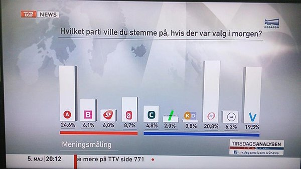
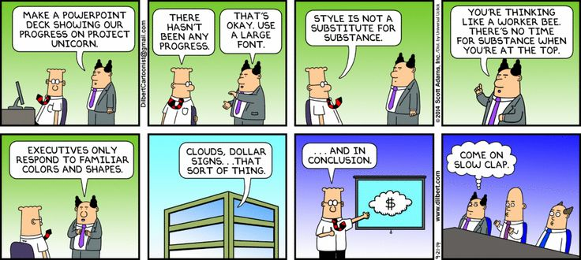
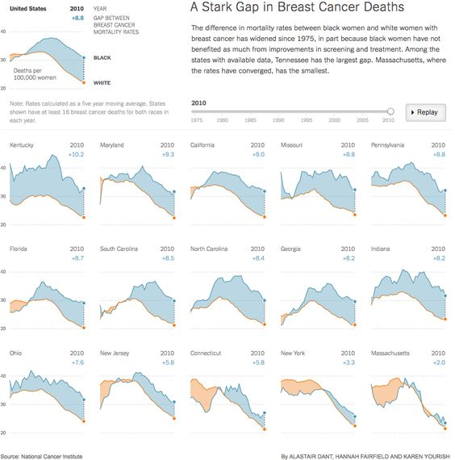
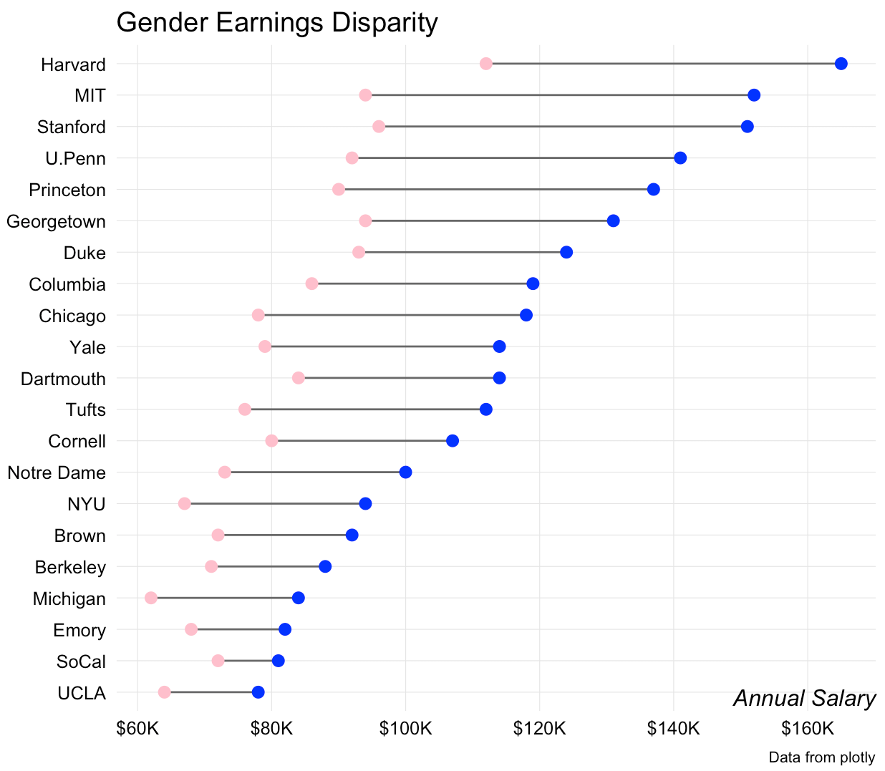
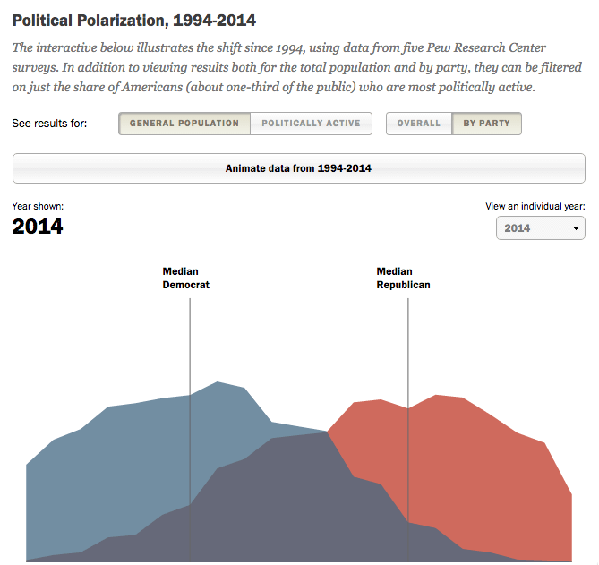
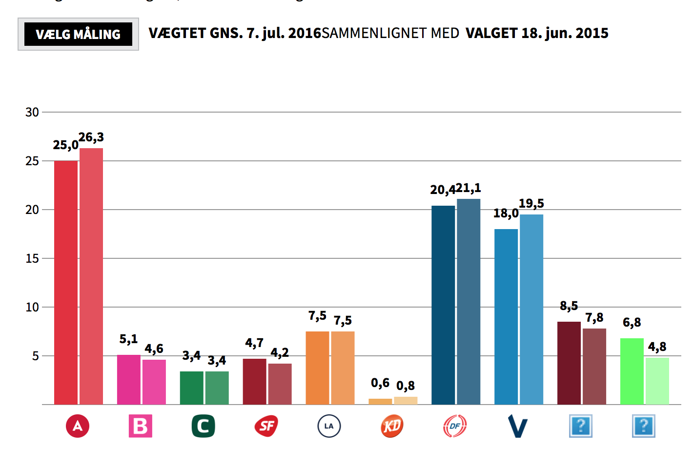
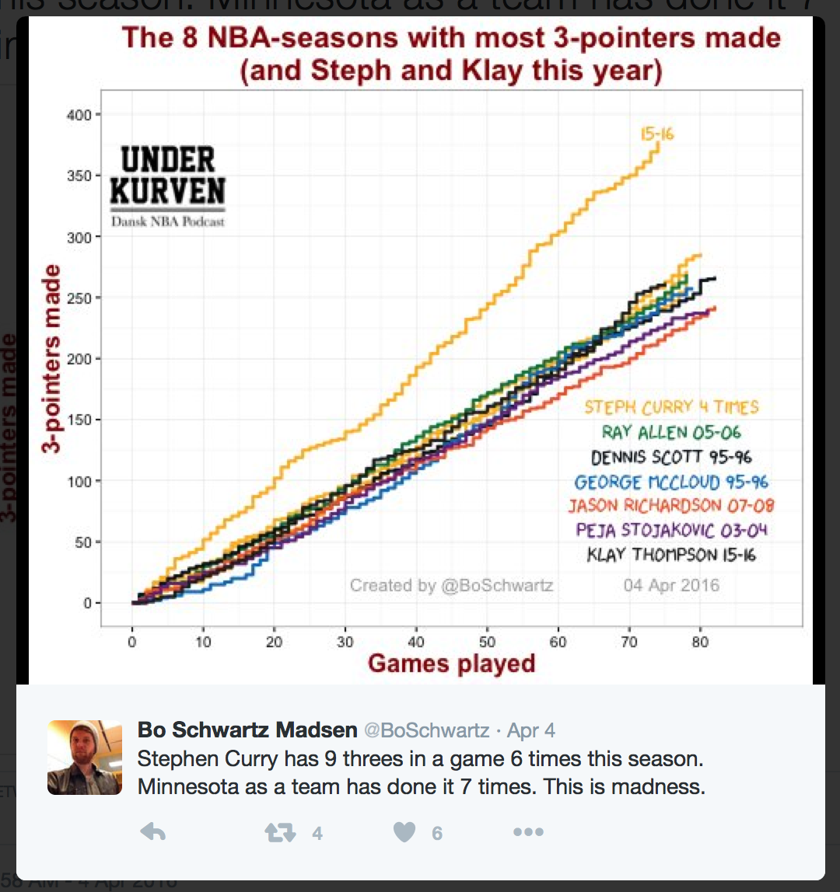
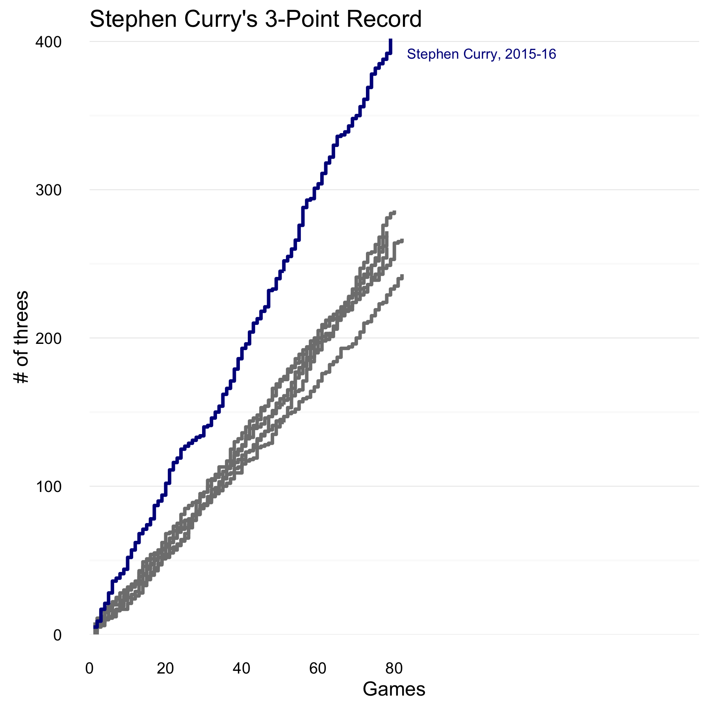

```{r Setup, include=FALSE, results='hide', warning=FALSE}
hook_output = knitr::knit_hooks$get('output')
knitr::knit_hooks$set(output = function(x, options) {
  # this hook is used only when the linewidth option is not NULL
  if (!is.null(n <- options$linewidth)) {
    x = knitr:::split_lines(x)
    # any lines wider than n should be wrapped
    if (any(nchar(x) > n)) x = strwrap(x, width = n)
    x = paste(x, collapse = '\n')
  }
  hook_output(x, options)
})
knitr::opts_chunk$set(
              dev= "pdf",
               fig.width=4.25,
               fig.height=2.5,
               fig.show="hold",
               fig.lp="fig:",
               fig.align = "center",
               dpi = 300,
               cache=TRUE,
               par=TRUE,
               echo=TRUE,
               message=FALSE,
               warning=FALSE)
```

## 

### Who's ahead in the polls?

\centering


## 

### What values are displayed in this chart?

\centering


## 

### The answer may surprise you

\centering


## Goals 

### What are you trying to accomplish?

1. Who's the audience?
  - Exploratory (use defaults) vs. explanatory (customize)
  - Raw data vs. model results 
2. Graphs should be self explanatory
3. A graph is a narrative - should convey key point(s)
  
## 

\centering

  
## Three basic principles

### Schwabish (2014)

1. Show the data (many graphs show too much)
2. Reduce the clutter
3. Integrate text and graph 

## Your turn

### Discuss in groups

1. Look at the eight transformed graphs in Schwabish (2014). What do you think about the transformations?

2. Are there other objectives of data visualization not mentioned by Schwabish?

3. If you were to improve on one of the eight transformed graphs, which one would you choose and how would you change it?

## Other considerations

Color palette 

Is your data numeric, binary, catetorical, text?

Should you truncate your y axis?

### Remember

Visualizing data is not just a matter of good taste

Basic perceptual processes play a very strong role

## 

\centering


## 

\centering


## 

\centering


## 

\centering


## 

\centering


## Some things I think work well

### Small multiples 

Tufte

> "Illustrations of postage-stamp size are indexed by category or a label, sequenced over time like the frames of a movie, or ordered by a quantitative variable not used in the single image itself."

##

\centering


## "Lollipops" and "dumbbells"

\centering


## Slopegraphs

\centering


## Data visualization software

### Static 

1. Base `R`
2. `lattice`
3. `ggplot2`

### Interactive 

1. D3 (javascript)
2. [htmlwidgets](http://www.htmlwidgets.org/) (R)
3. Tableau (commercial)

---

\LARGE `ggplot2`

## Why?

### Positives

- Great defaults 
- Intuitive
- Extremely well documented

### Negatives 

- Slow
- Limited functionality

## Grammar of graphics

`ggplot2` is based on the grammar of graphics, the idea that you can build every graph from the same few components: a dataset, a set of geoms—visual marks that represent data points, and a coordinate system

You start with your data, and then you assign a geometry to elements of that data, such as circle size to population, then you draw those geometries based upon some scaling of your data. When you think about visualization this way it helps you develop a better understanding of the data itself and think of proper ways to visualize it.

## A pew visualization of partisanship 

The Pew Research Center did an [interesting visualization](http://www.people-press.org/2014/06/12/section-1-growing-ideological-consistency/#interactive) of political polarization in the U.S. 

### Polarization

> The new survey finds that as ideological consistency has become more common, it has become increasingly aligned with partisanship. Looking at 10 political values questions tracked since 1994, more Democrats now give uniformly liberal responses, and more Republicans give uniformly conservative responses than at any point in the last 20 years

Bob Rudis [recreated their plot](https://rud.is/b/2016/07/07/bridging-the-political-polygons-gap-with-ggplot2/) in `ggplot2`. Let's see how. 

## 

\centering


## Basics 

`ggplot` works by building your plot piece by piece

First we need to load some data into `R` ([link here](https://raw.githubusercontent.com/sebastianbarfort/sds_summer/gh-pages/data/polarization.csv))

```{r}
library("readr")
gh.link = "https://raw.githubusercontent.com/"
user.repo = "sebastianbarfort/sds_summer/"
branch = "gh-pages/"
link = "data/polarization.csv"
data.link = paste0(gh.link, user.repo, branch, link)
df = read_csv(data.link)
names(df)
```

## Inspecting the data 

```{r, echo = FALSE}
names(df)
knitr::kable(head(df))
```

## `ggplot2` basics

`ggplot` works by building your plot piece by piece

Then we tell ggplot what pieces of the data frame we are interested in 

We create an object called `p` containing this information

Here, `x = x` and `y = pct` say what will go on the *x* and the *y* axes

These are \alert{aesthetic} mappings that connect pieces of the data to things we can actually see on a plot.

## 

```{r}
library("ggplot2")
p = ggplot(data = df, aes(x = x, y = pct))
```

## Aesthetics, but no geoms

The plot is so far just a frame with no actual information

```{r, echo = FALSE}
library("ggplot2")
theme_set(theme_gray() + theme(plot.background = element_rect(fill = "transparent")))
```

```{r base, echo = FALSE}
p
```

## Let's add a line

```{r line}
p = p + geom_line()
```

##

```{r, echo = FALSE}
p
```

## Problem

We need to inform `ggplot` that Democrats and Republicans are two separate groups.

This can be done using `fill`, `groups`, `shape`, `size` or `color`.

```{r}
p = ggplot(data = df, 
           aes(x = x, y = pct, 
               fill = party, color = party))
```

## Try again

```{r line2}
p = p + geom_line()
```

##

```{r, echo = FALSE}
p
```

## Thoughts

1. Shading below the line
2. Filling should be transparent
3. Custom filling
4. Axes should be modified
5. Subset by year 
6. Axis title
7. Background
8. Legend

## 1. Shading below the line

```{r ribbon1}
p = p + geom_ribbon(aes(ymin = 0, ymax = pct))
```

##

```{r, echo = FALSE}
p
```

## 2. Filling should be transparent

```{r ribbon2}
p = p + geom_ribbon(aes(ymin = 0, ymax = pct), 
                    alpha = .5)
```

##

```{r, echo = FALSE}
p
```

## 3. Custom filling

```{r}
p = p + scale_color_manual(
  name=NULL, 
  values=c(Dem="#728ea2",REP="#cf6a5d"),
  labels=c(Dem="Democrats", REP="Republicans")) +
  scale_fill_manual(
    name=NULL, 
    values=c(Dem="#728ea2", REP="#cf6a5d"),
    labels=c(Dem="Democrats", REP="Republicans")) +
  guides(color="none", 
         fill=guide_legend(override.aes=list(alpha=1)))
```

## 

```{r, echo = FALSE}
p
```

## 4. Axes should be modified

```{r}
p = p + 
  scale_x_continuous(
    expand = c(0,0), breaks = c(-8, 0, 8),
    labels= c("Consistently\nliberal", 
              "Mixed",
              "Consistently\nconservative")) +
  scale_y_continuous(
    expand = c(0,0), limits = c(0, 12))
```

## 

```{r, echo = FALSE}
p
```

## 5. Subset by year 

```{r}
p = p + facet_wrap(~ year, ncol = 2, 
                   scales = "free_x")
```

## 

```{r, echo = FALSE}
p
```

## 6. Axis title

```{r}
p = p + labs(x = NULL, 
             y = NULL,
             title = "Polarization, 1994-2014")
```


## 7. Background

```{r}
p = p + theme_minimal()
```


## 8. Legend

```{r}
p = p + 
  theme(legend.position = c(0.75, 0.1)) +
  theme(legend.direction = "horizontal") +
  theme(axis.text.y = element_blank())
```

```{r, echo = FALSE}
ggsave(plot = p, file = "figures/polarization.pdf",
       width = 8, height = 6)
```

## Output

\centering


## Visualizing Polls

How do you visualize polls?

New polls generate a lot of news stories

But much of it is probably noise 

How to deal with this visually?

## Berlingske



## Alternative 

A poll is not really a number 

It's a \alert{distribution}

Usually, that distribution is normal

So let's draw the distribution

## Read data 

```{r}
library("readr")
gh.link = "https://raw.githubusercontent.com/"
user.repo = "sebastianbarfort/sds_summer/"
branch = "gh-pages/"
link = "data/polls_tidy.csv"
data.link = paste0(gh.link, user.repo, branch, link)
df = read_csv(data.link)
```

##

### First five rows/columns

```{r, echo = FALSE}
knitr::kable(df[1:5, 1:5])
```

```{r, echo = FALSE}
library("dplyr")
df = df %>% 
  mutate(party.ord = toupper(Parti),
         party.ord = reorder(party.ord, -predicted))
```

## Your turn

### Inspect the dataset 

What do you think the variables `predicted` and `density` mean?

## Visualization

```{r}
p = ggplot(df, aes(x = predicted, y = density))
```

## 

```{r}
p = p + geom_line()
```

## 

```{r}
p = ggplot(df, aes(x = predicted, y = density, 
                   group = group, color = Parti))
p = p + geom_line()
```

## 

```{r}
p = ggplot(df, aes(x = predicted, y = density, 
                   group = group, color = Parti))
p = p + 
  geom_line() + 
  facet_grid(party.ord ~ ., 
             scales = "free_y", 
             switch = "y") 
```

## New strategy

```{r}
df.1 = subset(df, date != max(date))
df.2 = subset(df, date == max(date))
p = ggplot()
p = p + 
  geom_line(data = df.1, 
            aes(x = predicted, y = density, 
                group = group),
            color = "grey50", alpha = .25) + 
  facet_grid(party.ord ~ ., 
             scales = "free_y", switch = "y") 
```

## Add latest poll

```{r}
p = p + geom_line(data = df.2, 
              aes(x = predicted, y = density, 
                  group = group), 
              colour = "red", size = 1)
```

## Details I

```{r}
p = p + scale_x_continuous(
  breaks = scales::pretty_breaks(10)) +
  theme_minimal() +
  theme(strip.text.y = element_text(angle = 180, 
                                    face = "bold", 
                                    vjust = 0.75,
                                    hjust = 1),
        axis.text.y = element_blank()) +
  labs(y = NULL, x = NULL)
```

## Output

\centering


## Steph Curry

\centering
http://www.nytimes.com/interactive/2016/04/16/upshot/stephen-curry-golden-state-warriors-3-pointers.html

## 

\centering


## Data

```{r}
library("readr")
gh.link = "https://raw.githubusercontent.com/"
user.repo = "sebastianbarfort/sds_summer/"
branch = "gh-pages/"
link = "data/basket_tidy.csv"
data.link = paste0(gh.link, user.repo, branch, link)
df = read_csv(data.link)
```

## 

```{r, echo = FALSE}
knitr::kable(df[1:5, 1:6])
```

## Plot

```{r}
p = ggplot(data = df, 
           aes(x = games, 
               y = agg.three,
               color = as.factor(steph.ind),
               group = player))
```

## Add steps

```{r}
p = p + geom_step(size = 1) 
```

##

```{r, echo = FALSE}
p
```

## Fix scales, etc.

```{r}
p = p + scale_x_continuous(
    expand = c(0, 0),
    limits = c(0, 160),
    breaks = c(0, 20, 40, 60, 80)) +
  scale_y_continuous(
    expand = c(0, 0)) +
  theme_minimal()
```

## 

```{r, echo = FALSE}
p
```

## Fix color and axis labels

```{r}
p = p +
  scale_color_manual(
    values = c("grey50", "grey50", "darkblue")) +
  labs(x = "Games", 
       y = "# of threes", 
       title = "Stephen Curry's 3-Point Record")
```

## Theme changes

```{r}
p = p + 
  theme(legend.position = "none",
        axis.ticks.x = element_blank(),
        axis.line.x = element_blank(),
        panel.grid.major.x = element_blank(),
        panel.grid.minor.x = element_blank())
```

## 
```{r, echo = FALSE}
p
```

## Labels 

\centering
https://github.com/slowkow/ggrepel

## Preparation

```{r}
data.max = df %>% 
  filter(player == 
           "Stephen Curry, 2015-16") %>% 
  filter(agg.three == max(agg.three))
```

## Label

```{r}
library("ggrepel")
p = p +
  geom_text_repel(
    data = data.max,
    aes(label = player, 
        color = as.factor(steph.ind)),
    size = 3,
    nudge_x = 24,
    segment.size = 0
  ) 
```

## Output

\centering


## Firearm prices

Look at this visualization from [Bob Rudis](https://rud.is/b/2016/06/19/a-call-to-armslist-data-analysis/).

Data [here](https://raw.githubusercontent.com/sebastianbarfort/sds_summer/gh-pages/data/armslist.csv)

## Load data 

```{r}
library("readr")
gh.link = "https://raw.githubusercontent.com/"
user.repo = "sebastianbarfort/sds_summer/"
branch = "gh-pages/"
link = "data/armslist.csv"
data.link = paste0(gh.link, user.repo, branch, link)
df = read_csv(data.link)
```

## Create ggplot

```{r}
p = ggplot(data = df, aes(x = price))
```

## Your turn

### Discuss in groups

1. What is interesting about these data?
2. How would you visualize the distribution of the `price` variables
3. Search the `ggplot2` documentation [here](http://docs.ggplot2.org/current/) and create a visualization
4. Discuss how you would improve your visualization
5. Look at Bob Rudis' [plots](https://rud.is/b/2016/06/19/a-call-to-armslist-data-analysis/). Would you change anything? Do you think they work?

---

\LARGE Maps

## Making maps 

There are many ways to make maps in R

1. **easy**: use an existing package
2. **hard**: learn how to work with shapefiles (we don't have time for this today, but I strongly recommend reading [these notes](https://github.com/Robinlovelace/Creating-maps-in-R/raw/master/intro-spatial-rl.pdf) on the topic)

## Map packages

There are many useful packages for making maps in R 

- ``maps``: all kinds of maps
- ``ggcounty``: generate United States county maps
- ``ggmap``: extends ``ggplot2`` for maps
- ``mapDK``: maps of Denmark

